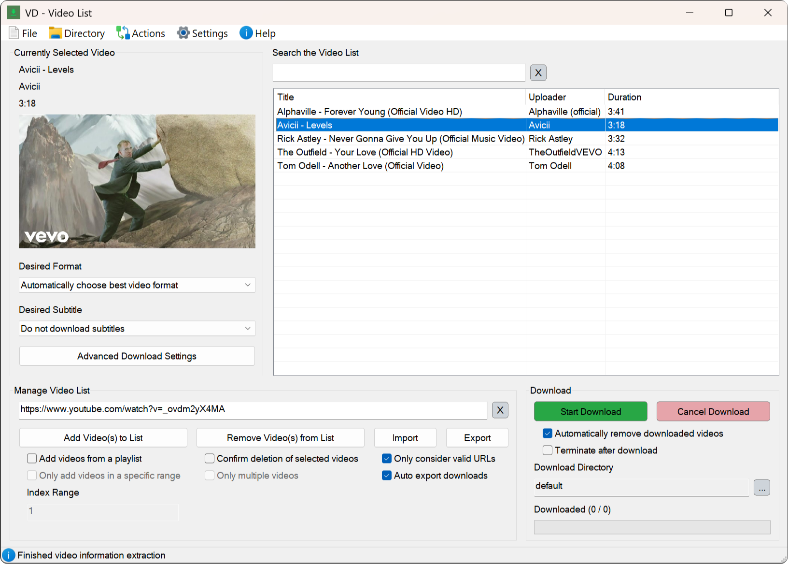

# **Video Downloader with basic AutoHotkey GUI**

        
         
        
         
        

**A video downloader with graphical user interface and hotkey control.**

Add videos to the list, select your download preferences and start downloading. No yt-dlp command knowledge required. 

  

    
     
    This is the main window <i>aka</i> the Video List
  

## Installation

> 1. Download the latest installer [here](https://github.com/LeoTN/yt-dlp-autohotkey-gui/releases/latest).
> 2. Follow the on-screen instructions.
> 3. Start downloading.

## Tutorial

> 1. Open the video you want to download in your browser. For example, this video: [https://www.youtube.com/watch?v=xvFZjo5PgG0](https://www.youtube.com/watch?v=xvFZjo5PgG0).
> 2. Press **SHIFT + CTRL + ALT + S** to save the URL.
> 3. Alternatively, you can copy the URL and enter it into the video list manually.
> 4. Press **SHIFT + CTRL + ALT + D** to start the download.

## Features

* **Convenient hotkey control** for all core functions.
* *Help Window* → contains additional information and interactive tutorials.
* *Settings Window* → change and configure your (download) preferences.
* *Video List Window* → easily manage and download videos.
* **Directly capture** video URLs by hovering over the video thumbnail (e.g. on the YouTube homepage) with the mouse cursor. Press **SHIFT + CTRL + ALT + F** to do so.

## Notes

* The hotkey to **directly capture video URLs** is still **experimental** and won't work every time.
* Sometimes yt-dlp's requests will be **blocked by YouTube**. This causes some videos to appear as **not found** in the video list.
  * If this is the case, I recommend trying to add the video again.
  * In rare cases, all requests are blocked. In this case, you can only wait a certain amount of time before trying again.

## Credits & License

* **yt-dlp** (<https://github.com/yt-dlp/yt-dlp>) for providing such an incredibly useful piece of software.
* **FFmpeg** (<https://ffmpeg.org>) for providing additional functionality for yt-dlp.
* **Acc library** (<https://github.com/Descolada/Acc-v2>) for important functions regarding direct URL capture.

I appreciate your **constructive** and **honest** feedback. Feel free to create an **issue** or **feature** request.

*This repository is licensed under the [MIT License](https://github.com/LeoTN/yt-dlp-autohotkey-gui/blob/main/LICENSE).*
