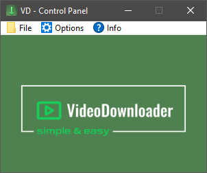
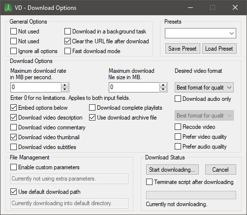

# **Video Downloader with basic AutoHotkey GUI**

**A video downloader with graphical user interface and hotkey control.**

This program lets users easily download videos without having to learn the command-line options of yt-dlp. The program can be conveniently controlled via hotkeys.

  

    
     
    This is the main GUI <i>aka</i> Control Panel
  

   
  

    
     
    You can customize your download settings here
  

   

## Installation

> 1. Download the installer from [here](https://github.com/LeoTN/yt-dlp-autohotkey-gui/releases/latest/download/VideoDownloaderInstaller.zip).
> 2. Extract the folder and run **VideoDownloader-Setup.exe**.
> 3. Follow the on-screen instructions.
> 4. Depending on your system and installed dependencies, the installation may take longer.
> 5. You will be notified once the installation is complete.

## Tutorial

> 1. Open the video you want to download in your browser. For example, this video: [https://www.youtube.com/watch?v=xvFZjo5PgG0](https://www.youtube.com/watch?v=xvFZjo5PgG0).
> 2. Press **SHIFT + CTRL + ALT + S** to save the URL.
> 3. Alternatively, you can hover over the video thumbnail (e.g. on the YouTube homepage) and press **SHIFT + CTRL + ALT + F** to capture the URL directly.
> 4. Select your preferred download options in the **Download Options Menu** (**SHIFT + CTRL + ALT + A** to open).
> 5. Press **SHIFT + CTRL + ALT + D** to start the download.

## Features

* **Convenient hotkey control** for all core functions.
* Various options provided by *yt-dlp* are available to fit your needs.
* *Control Panel Menu* (**SHIFT + CTRL + ALT + G**) for easy access to script functions.
* *Download Options Menu* (**SHIFT + CTRL + ALT + A**) to change download options, for instance the desired media format.
* Many customizable settings in the configuration file, for example, changing the hotkeys, custom paths for files and downloads or personal script launch options.

## Notes

* The easiest way to install the script is via the installer in the [latest release](https://github.com/LeoTN/yt-dlp-autohotkey-gui/releases/latest).
* Developers who want to use the repository need to compile parts of the script and may need to install components like Python or FFmpeg.
* Clone the repository and run **VideoDownloader-Setup.exe** from the installer archive to install the application. Select the repository folder *yt-dlp-autohotkey-gui* as the target folder.

* I appreciate your **constructive** and **honest** feedback. Feel free to create an issue or feature request.

## Credits & License

* **yt-dlp** (<https://github.com/yt-dlp/yt-dlp>) for providing such an incredibly useful application.
* **FFmpeg** (<https://ffmpeg.org/>) for additional functionality for yt-dlp.
* **Acc library** (<https://github.com/Descolada/Acc-v2>) for important functions regarding URL capture.
* **PSAppDeployToolkit** (<https://github.com/PSAppDeployToolkit/PSAppDeployToolkit>)

This repository is licensed under the [MIT License](https://github.com/LeoTN/yt-dlp-autohotkey-gui/blob/main/LICENCE).
