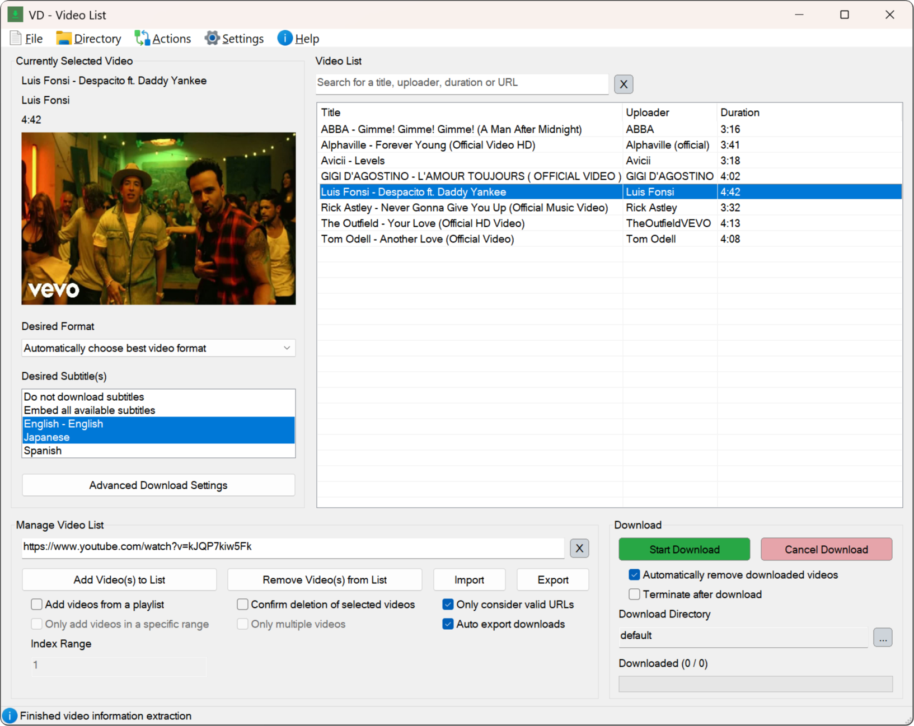

# **Video Downloader with basic AutoHotkey GUI**

        
         
        
         
        

**Add videos** to the list, **select** your **download preferences** and **start downloading**.

  

## 🚀 Getting Started

1. Download and install the latest installer [here](https://github.com/LeoTN/yt-dlp-autohotkey-gui/releases/latest).
2. Open the [video](https://www.youtube.com/watch?v=xvFZjo5PgG0) you want to download in your browser.
3. Press <code><strong><em>SHIFT + CTRL + ALT + S</em></strong></code> to save the URL.
4. Alternatively, you can copy the URL and enter it into the video list manually.
5. Press <code><strong><em>SHIFT + CTRL + ALT + D</em></strong></code> to start the download.

> [!TIP]
> You may download the [source code](https://github.com/LeoTN/yt-dlp-autohotkey-gui/archive/refs/heads/main.zip) and **run** or **compile** the file "*VideoDownloader.ahk*" yourself.

## Additional Information

| Feature                     | Description                                                               |
|-----------------------------|---------------------------------------------------------------------------|
| 🎬 **Playlists**            | Download **specific parts** or **whole** playlists.                       |
| ⌨️ **Hotkeys**              | Convenient **hotkey control** for all **core functions**.                 |
| 💡 **Help Window**          | Provides additional **information** and **interactive tutorials**.        |
| 🌐 **Direct Capture**       | Capture a **video URL** while the video is **open** in your **browser**.  |
| 🖱️ **Indirect Capture**     | Hover over a **video thumbnail** and press <code><strong><em>SHIFT + CTRL + ALT + F</em></strong></code>. |

<strong>Known Issues</strong>

* The hotkey to indirectly capture video URLs is still **experimental** and may not work every time.
* Embedding **video subtitles** may occasionally fail, causing the download to fail as well.
  * The issue seems to occur due to YouTube blocking requests caused by too many API calls.
* Sometimes yt-dlp requests may get temporarily **blocked (by YouTube)**, causing certain videos to show up as **not found** in the list.
  * If this happens, simply wait a bit before trying again.

## Credits & License

* [**yt-dlp**](https://github.com/yt-dlp/yt-dlp) → incredibly useful piece of software
* [**FFmpeg**](https://ffmpeg.org) → additional functionality for yt-dlp
* [**Acc library**](https://github.com/Descolada/Acc-v2) → important functions regarding direct URL capture
* [**ColorButton library**](https://github.com/nperovic/ColorButton.ahk) → colored button functionality
* [**Icons8**](https://icons8.com) → some of the used icons

> [!IMPORTANT]
> I appreciate your **constructive** and **honest** feedback. Feel free to create an **issue** or **feature** request.

*This repository is licensed under the [MIT License](https://github.com/LeoTN/yt-dlp-autohotkey-gui/blob/main/LICENSE).*