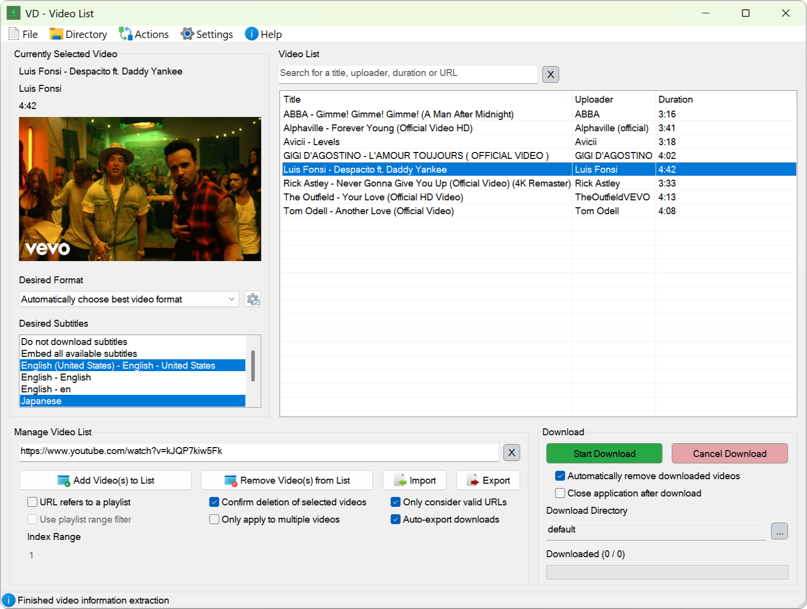

# **Video Downloader with basic AutoHotkey GUI**

        
         
        
         
        

**Add videos** to the list, **select** your **download preferences** and **start downloading**. No yt-dlp command knowledge required.

  

## 🚀 Getting Started

> 1. Download and install the latest installer **[here](https://github.com/LeoTN/yt-dlp-autohotkey-gui/releases/latest)**.
> 2. Open the [video](https://www.youtube.com/watch?v=xvFZjo5PgG0) you want to download in your browser.
> 3. Press ***SHIFT + CTRL + ALT + S*** to save the URL.
> 4. Alternatively, you can copy the URL and enter it into the video list manually.
> 5. Press ***SHIFT + CTRL + ALT + D*** to start the download.

## Additional Information

| Feature                     | Description                                                                                                                      |
|-----------------------------|----------------------------------------------------------------------------------------------------------------------------------|
| ⌨️ **Hotkey Control**       | Convenient **hotkey control** for all **core functions**                                                                         |
| 💡 **Help Window**          | Provides additional **information** and **interactive tutorials**                                                                |
| ⚙️ **Settings Window**      | Configure your default (download) preferences                                                                                    |
| 🎬 **Video List Window**    | Easily manage and download videos                                                                                                |
| 🌐 **Direct URL Capture**   | Capture a **video URL** while the video is **open** in your **browser**                                                          |
| 🖱️ **Indirect URL Capture** | Capture a **video URL** by **hovering** over the **video thumbnail** (e.g. on YouTube) and pressing ***SHIFT + CTRL + ALT + F*** |

### Known Issues

* The hotkey to indirectly capture video URLs is still **experimental** and won't work every time.
* Embedding **video subtitles** might not work every time.
* Sometimes yt-dlp's requests will be **blocked by YouTube**. This causes some videos to appear as **not found** in the video list.
  * If this is the case, I recommend waiting a little before trying again.

## Credits & License

* **yt-dlp** (<https://github.com/yt-dlp/yt-dlp>) → incredibly useful piece of software
* **FFmpeg** (<https://ffmpeg.org>) → additional functionality for yt-dlp
* **Acc library** (<https://github.com/Descolada/Acc-v2>) → important functions regarding direct URL capture
* **ColorButton library** (<https://github.com/nperovic/ColorButton.ahk>) → colored button functionality

I appreciate your **constructive** and **honest** feedback. Feel free to create an **issue** or **feature** request.

*This repository is licensed under the [MIT License](https://github.com/LeoTN/yt-dlp-autohotkey-gui/blob/main/LICENSE).*